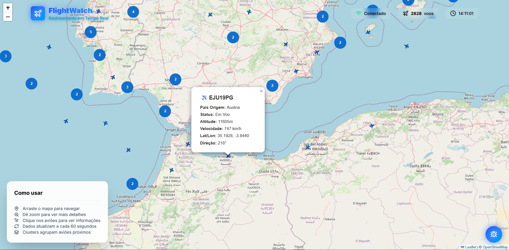
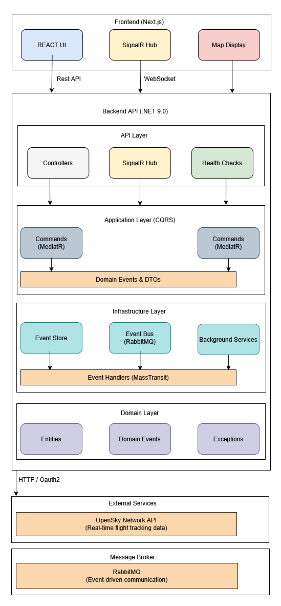
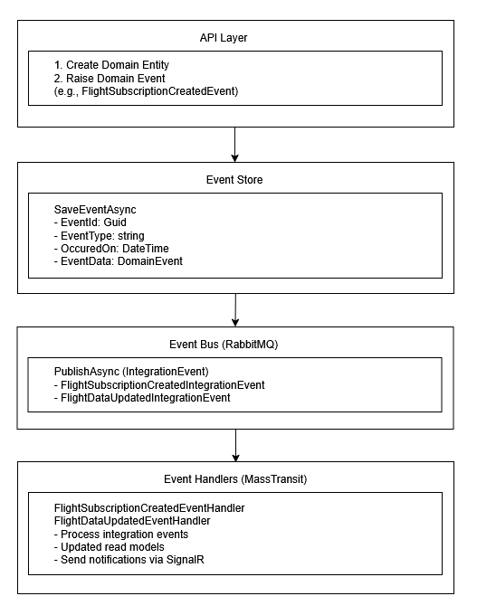

# FlightWatch 🛫

<p align="left">
  
  
  
  
  
  
  
  
  
  
  
  
  
</p>

A professional, real-time flight tracking system built with **Clean Architecture**, **CQRS**, and **Event Sourcing**. FlightWatch connects to the OpenSky Network API to provide real-time aircraft data including GPS positions, flight information, and airline details.

### 🎥 System Preview




## 🏗️ Architecture Overview

FlightWatch follows **Clean Architecture** principles with clear separation of concerns across multiple layers, implementing **CQRS (Command Query Responsibility Segregation)** and **Event Sourcing** patterns for scalability, maintainability, and resilience.

### System Topology



## 📐 Clean Architecture Layers

### 1. **Domain Layer** (`FlightWatch.Domain`)
The innermost layer containing pure business logic with no external dependencies.

- **Entities**: Core business objects (`Flight`, `FlightSubscription`, `User`)
- **Domain Events**: Business events (`FlightSubscriptionCreatedEvent`, `FlightDataUpdatedEvent`)
- **Exceptions**: Domain-specific exceptions
- **Interfaces**: Domain contracts (no implementations)

### 2. **Application Layer** (`FlightWatch.Application`)
Contains application logic, use cases, and orchestration.

- **CQRS Implementation**:
  - **Commands**: Write operations (`SubscribeFlightCommand`, `UnsubscribeFlightCommand`)
  - **Queries**: Read operations (`GetLiveFlightsQuery`, `GetLiveFlightsByAreaQuery`)
  - **Handlers**: Business logic handlers using MediatR
- **DTOs**: Data Transfer Objects for API communication
- **Events**: Integration events for cross-boundary communication
- **Interfaces**: Application service contracts
- **Mappings**: AutoMapper profiles

### 3. **Infrastructure Layer** (`FlightWatch.Infrastructure`)
Implements external concerns and technical details.

- **Event Store**: In-memory event persistence (ready for database migration)
- **Event Bus**: RabbitMQ integration via MassTransit
- **Event Handlers**: Integration event consumers
- **Background Services**: Periodic flight data updates
- **External Services**: OpenSky API client
- **Repositories**: Data access implementations
- **Security**: JWT token generation and password hashing
- **Configuration**: Resilience policies (Polly), settings

### 4. **API Layer** (`FlightWatch.Api`)
The presentation layer and entry point.

- **Controllers**: REST API endpoints
- **SignalR Hub**: Real-time WebSocket communication
- **Middleware**: Exception handling, correlation IDs, response compression
- **Health Checks**: System health monitoring with UI dashboard
- **Configuration**: Dependency injection, authentication, telemetry

## 🔄 CQRS (Command Query Responsibility Segregation)

FlightWatch implements CQRS to separate read and write operations, enabling independent scaling and optimization.

### Command Side (Write)

**Commands** represent user intentions that modify system state:

```csharp
// Example: SubscribeFlightCommand
public record SubscribeFlightCommand(
    string ConnectionId,
    string? AreaName,
    double MinLatitude,
    double MaxLatitude,
    double MinLongitude,
    double MaxLongitude,
    int UpdateIntervalSeconds,
    Guid? UserId) : IRequest<Result<SubscriptionDto>>;
```

**Command Handlers** process commands and:
1. Validate business rules
2. Create domain entities
3. Persist to repository
4. Raise domain events
5. Publish integration events

```csharp
public class SubscribeFlightCommandHandler : IRequestHandler<SubscribeFlightCommand, Result<SubscriptionDto>>
{
    // 1. Create subscription entity
    // 2. Save to repository
    // 3. Save domain event to event store
    // 4. Publish integration event to event bus
    // 5. Trigger immediate flight data fetch
}
```

### Query Side (Read)

**Queries** represent read operations that don't modify state:

```csharp
// Example: GetLiveFlightsByAreaQuery
public record GetLiveFlightsByAreaQuery(
    double MinLatitude,
    double MaxLatitude,
    double MinLongitude,
    double MaxLongitude) : IRequest<Result<IEnumerable<FlightDto>>>;
```

**Query Handlers** retrieve and return data:
- Directly from repositories
- From read models (if implemented)
- No side effects

### Benefits of CQRS in FlightWatch

1. **Independent Scaling**: Read and write operations can scale separately
2. **Optimized Queries**: Read models can be denormalized for performance
3. **Clear Separation**: Business logic is explicit and testable
4. **Event Sourcing Ready**: Commands naturally produce events

## 📚 Event Sourcing Architecture

FlightWatch uses **Event Sourcing** to store all changes as a sequence of events, providing a complete audit trail and enabling time-travel queries.

### Event Flow



### Domain Events vs Integration Events

**Domain Events** (`IDomainEvent`):
- Represent business occurrences within a bounded context
- Stored in the Event Store
- Example: `FlightSubscriptionCreatedEvent`

**Integration Events** (`IIntegrationEvent`):
- Represent events that cross bounded contexts
- Published to message broker (RabbitMQ)
- Example: `FlightDataUpdatedIntegrationEvent`

### Event Store Implementation

Currently using **In-Memory Event Store** for development:

```csharp
public class InMemoryEventStore : IEventStore
{
    private readonly ConcurrentBag<StoredEvent> _events = [];
    
    public Task SaveEventAsync<TEvent>(TEvent @event, ...)
        where TEvent : IDomainEvent
    {
        // Store event with metadata
        _events.Add(new StoredEvent { ... });
    }
    
    public Task<IEnumerable<IDomainEvent>> GetEventsAsync(Guid aggregateId, ...)
    {
        // Retrieve events for aggregate reconstruction
    }
}
```

**Future Enhancement**: Migrate to persistent storage (PostgreSQL, EventStore, etc.)

### Benefits of Event Sourcing

1. **Complete Audit Trail**: Every change is recorded
2. **Time Travel**: Reconstruct state at any point in time
3. **Event Replay**: Rebuild read models from events
4. **Debugging**: Understand exactly what happened and when
5. **Scalability**: Events can be processed asynchronously

## 🔀 Complete Request Flow

### 1. User Subscribes to Flight Area

```
Frontend (React)
    │
    │ WebSocket: SubscribeToFlight({ bounds, areaName })
    │
    ▼
SignalR Hub (FlightHub)
    │
    │ MediatR: SubscribeFlightCommand
    │
    ▼
Command Handler (SubscribeFlightCommandHandler)
    │
    ├─► Create FlightSubscription entity
    ├─► Save to Repository
    ├─► Create Domain Event: FlightSubscriptionCreatedEvent
    ├─► Save to Event Store
    ├─► Create Integration Event: FlightSubscriptionCreatedIntegrationEvent
    ├─► Publish to Event Bus (RabbitMQ)
    └─► Trigger immediate flight data fetch
    │
    ▼
Background Service (FlightUpdateBackgroundService)
    │
    │ Fetch from OpenSky API
    │
    ▼
FlightMonitoringService
    │
    ├─► Create Integration Event: FlightDataUpdatedIntegrationEvent
    └─► Publish to Event Bus
    │
    ▼
Event Handler (FlightDataUpdatedEventHandler)
    │
    ├─► Map to FlightDto
    └─► Send via SignalR to client
    │
    ▼
Frontend receives real-time flight updates
```

### 2. Periodic Flight Updates

```
Background Service (FlightUpdateBackgroundService)
    │
    │ Every 30 seconds
    │
    ├─► Get all active subscriptions
    ├─► Check if update needed (based on UpdateIntervalSeconds)
    ├─► Fetch flight data from OpenSky API (max 5 concurrent)
    ├─► Create FlightDataUpdatedIntegrationEvent
    └─► Publish to Event Bus
    │
    ▼
Event Handler processes and notifies clients via SignalR
```

### 3. Query Flight Data

```
Frontend (React)
    │
    │ REST API: GET /api/flights/live?minLat=...&maxLat=...
    │
    ▼
Controller (FlightsController)
    │
    │ MediatR: GetLiveFlightsByAreaQuery
    │
    ▼
Query Handler (GetLiveFlightsByAreaQueryHandler)
    │
    ├─► Query OpenSky API
    └─► Return FlightDto collection
    │
    ▼
Frontend receives flight data
```

## 🛠️ Technology Stack

### Backend
- **.NET 9.0** - Latest .NET framework
- **ASP.NET Core** - Web framework
- **MediatR** - CQRS implementation
- **MassTransit** - Message bus abstraction
- **RabbitMQ** - Message broker
- **SignalR** - Real-time WebSocket communication
- **AutoMapper** - Object mapping
- **Polly** - Resilience and retry policies
- **Serilog** - Structured logging
- **OpenTelemetry** - Distributed tracing
- **Health Checks UI** - Monitoring dashboard
- **Response Compression** - Brotli/Gzip compression

### Frontend
- **Next.js 15** - React framework
- **TypeScript** - Type safety
- **Leaflet** - Interactive maps
- **SignalR Client** - Real-time updates
- **Tailwind CSS** - Styling

### Infrastructure
- **Docker** - Containerization
- **Docker Compose** - Multi-container orchestration
- **RabbitMQ** - Message broker

## 🚀 Getting Started

### Prerequisites

- Docker and Docker Compose
- .NET 9.0 SDK (for local development)
- Node.js 18+ (for frontend development)

### Environment Variables

Create a `.env` file in the root directory:

```env
# OpenSky Network API
OPENSKY_CLIENT_ID=your_client_id
OPENSKY_CLIENT_SECRET=your_client_secret

# JWT Settings
JWT_SECRET_KEY=your_secret_key_min_32_chars

# RabbitMQ
RABBITMQ_PASSWORD=your_rabbitmq_password

# Frontend
NEXT_PUBLIC_API_URL=http://localhost:8080/api
NEXT_PUBLIC_HUB_URL=http://localhost:8080/hubs/flights
```

### Running with Docker Compose

```bash
# Start all services
docker-compose up -d

# View logs
docker-compose logs -f

# Stop all services
docker-compose down
```

### Services

- **API**: http://localhost:8080
- **Frontend**: http://localhost:3001
- **RabbitMQ Management**: http://localhost:15672 (guest/guest)
- **Health Checks UI**: http://localhost:8080/health-ui
- **Mongo Express (MongoDB UI)**: http://localhost:8081
  - Username: `admin` (or `MONGO_EXPRESS_USERNAME` env var)
  - Password: `admin` (or `MONGO_EXPRESS_PASSWORD` env var)

## 📊 Key Features

### 1. Real-Time Flight Tracking
- Live aircraft positions on interactive map
- Automatic updates via SignalR
- Configurable update intervals

### 2. CQRS Architecture
- Clear separation of commands and queries
- Independent scaling of read/write operations
- Testable business logic

### 3. Event Sourcing
- Complete audit trail of all changes
- Event-driven architecture
- Asynchronous event processing

### 4. Resilience
- Retry policies with exponential backoff
- Circuit breaker pattern
- Timeout handling
- Health checks

### 5. Observability
- Structured logging with Serilog
- Distributed tracing with OpenTelemetry
- Health check dashboard
- Correlation IDs for request tracking

### 6. Performance Optimizations
- Response compression (Brotli/Gzip)
- Debounced map movements
- Throttled updates
- Concurrent request limiting

## 🏛️ Design Patterns

1. **Clean Architecture** - Layered architecture with dependency inversion
2. **CQRS** - Command Query Responsibility Segregation
3. **Event Sourcing** - Store events instead of current state
4. **Repository Pattern** - Data access abstraction
5. **Result Pattern** - Explicit success/failure handling
6. **Mediator Pattern** - Decoupled request handling (MediatR)
7. **Observer Pattern** - Event-driven communication
8. **Strategy Pattern** - Configurable resilience policies

## ⚠️ Disclaimer – Flight Tracking Limitations

FlightWatch retrieves all aircraft data from the **OpenSky Network API**, which relies primarily on **ADS-B receivers** and, in some regions, **MLAT (Multilateration)**. Because of this, the data shown in the system is subject to the following limitations:

- **Coverage is not globally uniform** — remote areas, regions with few receivers, and certain countries may have partial or no visibility.
- **Data accuracy and update frequency vary** depending on receiver availability and signal quality.
- **Not all aircraft are trackable** — some disable their transponder, operate in restricted modes, or are not ADS-B equipped.
- **Delays, gaps, or missing data** may occur due to network limitations, atmospheric conditions, or operator privacy constraints.

FlightWatch displays flight information **exactly as provided by the OpenSky Network**, without guarantees of completeness, accuracy, or real-time precision.

## 📈 Scalability Considerations

- **Horizontal Scaling**: Stateless API allows multiple instances
- **Message Queue**: RabbitMQ enables async processing
- **Read/Write Separation**: CQRS allows independent scaling
- **Event-Driven**: Loose coupling enables microservices migration
- **Caching**: Ready for Redis integration
- **Database**: Event Store can be migrated to distributed storage

## 🔒 Security

- JWT-based authentication
- Refresh token rotation
- Password hashing (BCrypt)
- HTTPS in production
- Environment variable secrets
- Input validation

## 📝 License

This project is for portfolio/demonstration purposes.

## 🤝 Contributing

This is a portfolio project demonstrating professional software architecture patterns and best practices.

---

**Built with ❤️**

